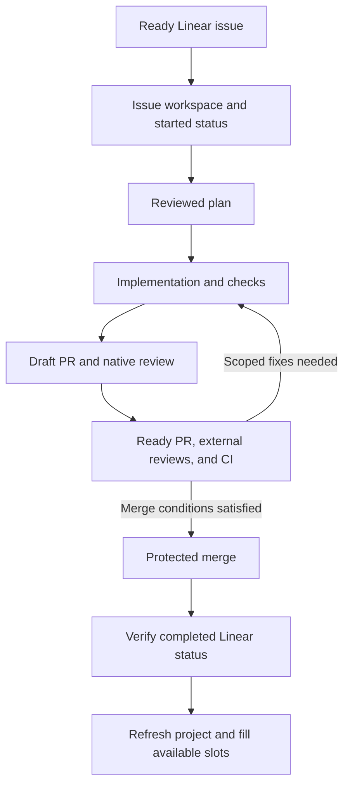

# Monkey Maestro operating guide

Give Monkey Maestro a Linear project and authorize delivery through merge. It supervises
one Superset workspace per issue, using Codex or Claude Code, and follows the work through
planning, implementation, review, CI, merge, and Linear completion. You provide product
decisions when needed; you do not have to request each workflow step separately.

Supervision runs in the active agent conversation. Keep that session running while you
want Maestro to monitor workers and start newly available issues.

## Before starting

The supervisor and issue workers need the relevant plugins and skills available:

| Plugin                                        | Role                                                                                             |
| --------------------------------------------- | ------------------------------------------------------------------------------------------------ |
| [Monkey Maestro](README.md)                   | Select issues, create or recover Superset workspaces, supervise workers, and relay questions.    |
| [Linear Devotee](../linear-devotee/README.md) | Own each issue through `linear-devotee:deliver`, including its reviewed plan and implementation. |
| [Git Gremlin](../git-gremlin/README.md)       | Finish its PR through `git-gremlin:finish-pr`, including review corrections and protected merge. |

Use versions that expose `deliver` and `finish-pr`. The supervisor needs access to the
Linear project and an online Superset host. The selected host needs the repository and a
terminal-capable Codex or Claude agent preset. Workers need the repository's development
prerequisites, Linear access, GitHub access, and their runtime's local review command.

Start from the repository's Superset workspace when possible. Maestro discovers the host,
repository, and agent from that context, and asks about ambiguous choices. Project
orchestration groups its issue workspaces in a folder dedicated to that run.

## Start a project

Send a request like this in your Codex or Claude Code conversation:

```text
Use Monkey Maestro to deliver the Linear project <PROJECT_URL> through protected merge.
Use Codex with at most 3 started issues. Supervise the project in this session and ask
me when a product decision is needed.
```

You can also invoke the skill by name once the project id is known:

```text
monkey-maestro:start <PROJECT_ID> --agent codex --max-concurrency 3
```

These examples are agent requests, not shell commands. Replace the placeholders with
your project or issue. Use `--agent claude` to select a configured Claude terminal preset;
omit `--agent` to let Maestro resolve the available preset from the current runtime.

Before activation, Maestro shows the exact Linear project, Superset host and repository,
agent, workspace folder, concurrency, and delivery scope. It uses your existing authorization when that
covers the displayed scope; otherwise it asks once. That authorization carries through
plans, scoped commits and pushes, PRs, review fixes and replies, protected merge, and the
issue's completion status. It does not repeat the same permission question at every stage.

`start` records the project configuration in Linear and enters supervision. You do not
need to call `orchestrate` separately. Concurrency defaults to four and accepts one to ten.
Sending only a project URL requests a read-only status report; explicitly ask to start
delivery when that is your intent.

## One workspace folder per run

Maestro chooses a folder name from the Linear project name, the start time in UTC, and a
short run identifier. For example, the Superset sidebar can show:

```text
notom platform · 2026-10-09 1230 utc · a1b2c3d4
  NOT-734 — Add an action
  NOT-735 — Edit a condition
  NOT-736 — Open a transition
```

Superset stores folder tags in lowercase with a 64-character limit. Maestro shortens the
project-name portion when needed, keeping the date and run identifier.

The name is saved with the run in Linear. Superset creates the sidebar folder through the
workspaces' tags, so it appears when the first issue workspace is created. Every new issue
workspace in that run uses the same folder; each still has its own Git branch and files.
The supervisor's workspace keeps its current placement.

Continuing an active run with `orchestrate`, including from another conversation after a
handoff, reuses the saved folder. A project rename, a different day, or a different
supervisor workspace does not rename it. Updating an active run's settings also preserves
its folder. `stop` preserves the folder and existing work.
Starting a new run after stopping chooses a new folder.

Maestro checks the actual placement. If the run's tag is missing from a workspace whose
ownership is already established, it restores that tag when the existing tags can be
read without ambiguity. Otherwise it reports the placement problem and keeps the current
groups untouched; independent work can continue. It does not move an unrelated workspace
into the run merely because its name or branch looks similar.

## Run one issue

For a single issue through merge, use:

```text
monkey-maestro:spawn <ISSUE_ID> --through-merge --agent codex
```

Maestro creates or recovers that issue's workspace and launches its delivery owner. Follow
the work in that workspace. Manual `spawn` does not activate project supervision or start
other issues, and it does not apply the project's concurrency limit or active control.
New manual workspaces inherit the source workspace's sidebar groups. Recovered workspaces
keep their existing groups, including a folder from a previous orchestration; manual spawn
does not create or change a project run's folder.

Without `--through-merge` or equivalent explicit authorization, issue spawn keeps the
draft-PR scope. A free-form quick fix has a separate, bounded edit-and-check scope.

## What happens for each issue



The issue owner reads repository instructions and Linear acceptance criteria, prepares or
reuses a reviewed plan, implements the missing work, and runs the relevant checks. It
creates a draft PR when needed, then hands that PR to the finishing workflow. Existing
work is inspected and reused after an interruption.

Each issue retains its own workspace, branch, and PR. Maestro checks their actual bindings
before launching or recovering a worker. An uncertain launch is inspected before another
attempt; a quiet terminal does not establish completion.

The issue owner may delegate useful investigation or implementation to a small team.
Specialists get explicit responsibilities and separate workspaces or disjoint file
ownership. The owner checks integration after meaningful changes and remains responsible
for the result. Teams are optional; final code review uses the worker runtime's native
review facility.

## Reviews and merge conditions

The delivery owner runs the native review against the verified PR base and reads its
findings:

| Worker runtime | Native review                                                                |
| -------------- | ---------------------------------------------------------------------------- |
| Codex          | `codex review --base <verified-base-ref>`                                    |
| Claude Code    | Local `/code-review <verified-base-ref>...HEAD`, awaited through completion. |

You do not need to invoke these commands manually during full delivery. A successful
review command can still contain findings. The owner fixes supported defects within the
issue's scope and explains feedback it declines. Fixes are pushed before replies claim
they are available. Code or relevant base changes require refreshed review and checks.

After native review and local verification, the owner marks the draft ready and waits for
the repository's external reviews and CI. For a repository expecting CodeRabbit, require
its completed review for the current PR head. A green status saying the review was skipped
because the PR was a draft does not establish that review; wait for the actual completion
after the PR becomes ready.

Before merging, the workflow requires:

- Current verification and successful CI, including required checks. Missing, pending,
  failed, or entirely skipped checks do not establish success; completed conditional
  skips can coexist with successful checks.
- Addressed review findings and no unresolved review threads, including outdated threads.
  Declined feedback needs an explanation before its thread is resolved.
- Required GitHub approvals and no outstanding changes-requested review. Resolving a
  conversation does not supply the reviewer's approval.
- Matching reviewed code and PR identity, and a merge permitted by repository policy.

The workflow uses the repository's permitted merge path and does not bypass protections.
A merge queue entry or enabled auto-merge remains pending until GitHub shows the actual
merge. Full issue delivery is done only after the matching PR is observed merged and
Linear is read back in the correct completed state.

If the merge succeeds but the Linear update fails, recovery finishes that status update
using the same PR. If the issue is already fixed by a matching merged PR, the owner can
verify that evidence and reconcile completion without manufacturing a new change. An
unexplained bug that cannot currently be reproduced may still need a product decision.

## How parallel work is selected

Linear controls readiness and capacity. Every issue whose status type is `started`
occupies a slot, including manually started work and issues waiting for CI or a decision.
For example, a limit of four with two started issues leaves two slots.

Candidates come from backlog, triage, or unstarted states. All current blockers must be
known and terminal in the live project read; terminal means completed or canceled.
Missing dependency information prevents selection. Ready issues are selected in stable
identifier order. After progress, Maestro rereads Linear before filling another slot.

Sidebar groups do not restrict the Linear issue selection. Starting from a source folder
named `lot 4` still authorizes the selected Linear project and uses that run's own folder. For an
individual issue, use `spawn` with its exact identifier. This workflow has no milestone
filter argument.

Workspaces isolate code, but local ports, browser sessions, and test data can still be
shared. Maestro coordinates conflicting verification steps while independent planning,
coding, and checks continue. Workers preserve unrelated services and data.

Run one supervisor per project run. The concurrency calculation relies on fresh Linear
state; it is not a global lock against another supervisor or unrelated manual launches.

## Questions and progress

Maestro handles routine technical choices within the authorized scope. It brings you
consequential product decisions, conflicting acceptance criteria, scope changes, missing
authority, or persistent failures. A question includes the issue, the decision, available
options, and what the answer unlocks. Reply in the supervisor conversation; Maestro
relays the answer to the existing worker while independent issues keep moving.

Runtime permission dialogs still need to be handled through the runtime's approval
interface. Required GitHub reviews still need the appropriate reviewer. Delivery
authorization does not let Maestro answer those prompts or supply those approvals.

Reports distinguish these issue outcomes:

| Outcome   | Meaning                                                                                                  |
| --------- | -------------------------------------------------------------------------------------------------------- |
| `done`    | The matching PR is merged and Linear completion has been verified.                                       |
| `waiting` | A specific event or recovery step is pending, such as CI, approval, the merge queue, or a Linear update. |
| `blocked` | A concrete decision, unavailable prerequisite, or persistent failure prevents dependent work.            |

An issue that is waiting or blocked still occupies its slot while its Linear status is
started. A project report treats canceled issues as terminal without claiming they were
delivered.

## Inspect, resume, and stop

Use these requests in the agent conversation:

| Request                                               | Effect                                                                                                                       |
| ----------------------------------------------------- | ---------------------------------------------------------------------------------------------------------------------------- |
| `monkey-maestro:status <PROJECT_URL_OR_ID>`           | Read Linear configuration, issue counts, and capacity. It does not inspect running Superset sessions.                        |
| `monkey-maestro:reconcile <PROJECT_ID> [ISSUE_ID...]` | Inspect the configured project's issue, workspace, and terminal associations. Read-only; it does not repair or restart work. |
| `monkey-maestro:orchestrate <PROJECT_ID>`             | Continue supervision of an active, authorized project after checking supervisor ownership.                                   |
| `monkey-maestro:stop <PROJECT_ID>`                    | Disable future project dispatches, recovery, and follow-ups. Existing issue workers keep their authorized scope.             |
| `monkey-maestro:start <PROJECT_ID>`                   | Activate or reactivate the project and enter supervision.                                                                    |

To resume in another conversation, establish that the previous supervisor stopped, or
explicitly hand the run over after ending the old loop. Maestro then rereads Linear,
GitHub, and worker state, preserves the workspace and PR, and resumes the next missing
step. An active project configuration alone does not prove a supervisor is running or
that the current conversation owns the run.

An interrupted individual worker is recovered in the same workspace, using its native
session when available. A manual recovery request uses the same `spawn` issue and original
scope; it cannot launch a second worker while the first is live or its state is uncertain.

Closing the supervisor conversation ends supervision. It does not terminate existing
workers or create a background scheduler. When all remaining work awaits external input,
Maestro can checkpoint and report the exact resume action. Scheduled Superset automation
requires a separate setup request.

`stop` also leaves workers running, so they may finish their already-authorized PRs and
merges. To stop an individual worker as well, explicitly identify it and request that
action. Neither completion nor project stop deletes issue workspaces or branches.

## Workflow references

The detailed behavior lives in the [project execution contract](shared/project-execution-contract.md),
the [issue delivery skill](../linear-devotee/skills/deliver/SKILL.md), and the
[PR finishing skill](../git-gremlin/skills/finish-pr/SKILL.md).
